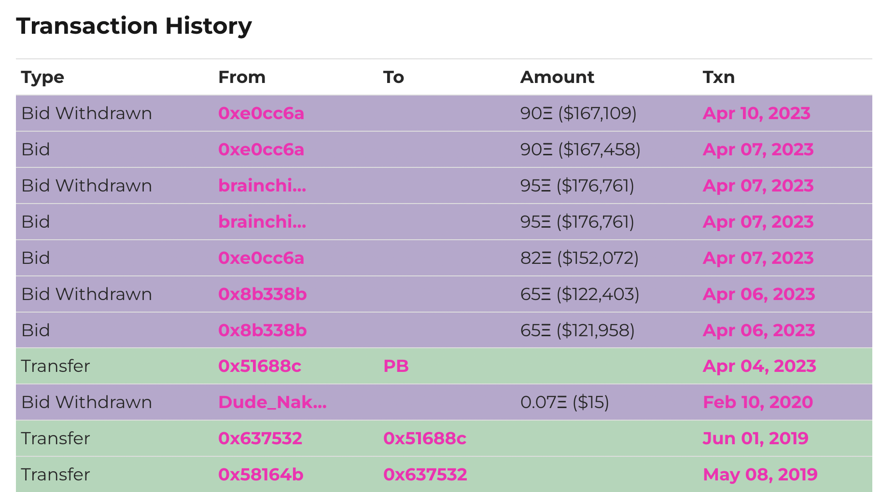
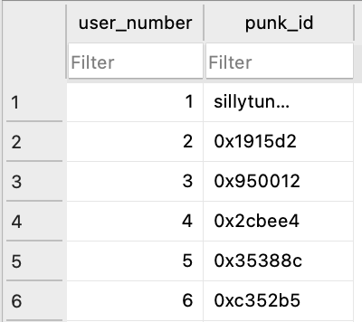
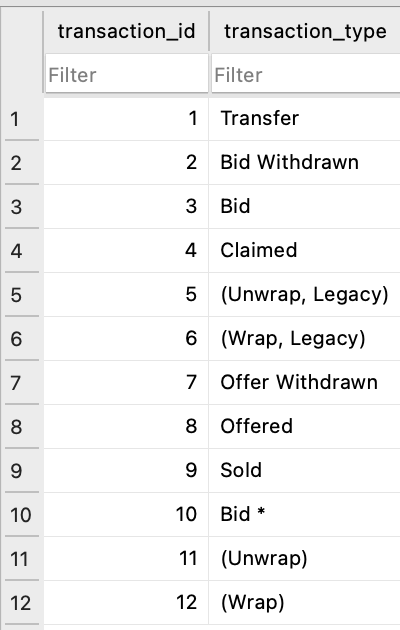
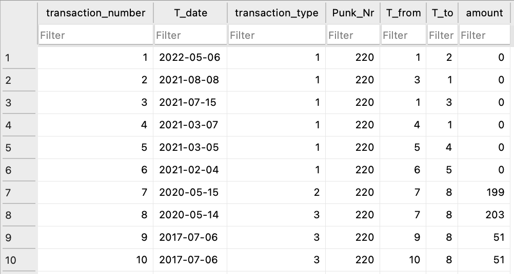
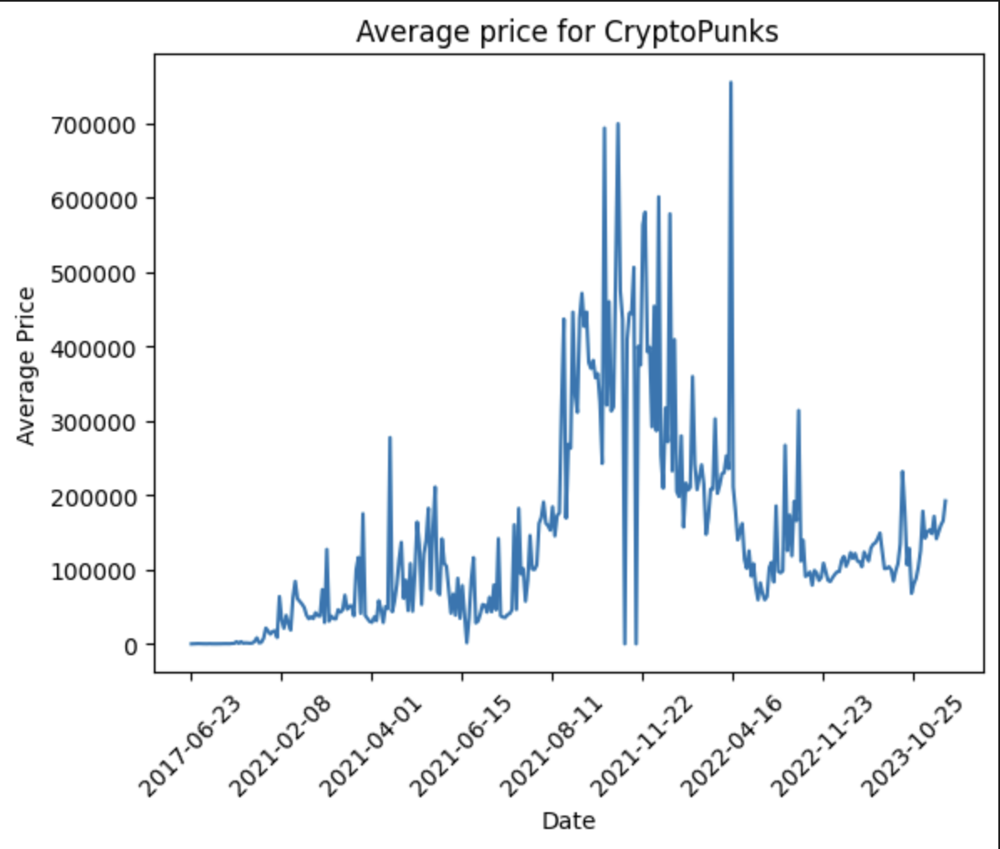

# Cryptopunk-Analysis
<p align="center">
  
</p>

### Intro

In this notebook I scrape the transaction data from the [Cryptopunks website](https://cryptopunks.app/) for 500 Cryptopunks, store it in a SQLite database and write some queries to get some information out of the data. But first a bit of background on Cryptopunks. Cryptopunks are one of the earliest examples of non-fungible tokens (NFTs) on the Ethereum blockchain, launched in June 2017 by Larva Labs. They consist of 10,000 unique 24x24 pixel art characters, generated algorithmically. Each Cryptopunk has distinct attributes, such as different hairstyles, accessories, and facial expressions, making some more rare and valuable than others.

The Cryptopunks collection includes a variety of characters, including humans, zombies, apes, and aliens. Ownership of a Cryptopunk is verified through the Ethereum blockchain, ensuring the provenance and uniqueness of each piece. Originally given away for free, Cryptopunks have since become highly sought after, with some selling for millions of dollars at auction.

### Part 1:

Import libaries and set up the database:

```shell
import requests
from bs4 import BeautifulSoup
import sqlite3 as lite
import time
from datetime import datetime
import re
import pandas as pd
import numpy as np
import matplotlib.pyplot as plt
```

```shell
#Create database connection
try:
    conn = lite.connect('Punk.db')
    print('connection was successful')
except Exception as e:
    print('there was an error with connectiong to the DB')

cur = conn.cursor()
```

Here is an example of the transaction information that is displayed for a single Cryptopunk. I'm trying to scrape that data using Beautiful Soup and store it in the database.
<p align="center">
  
</p>

Let's create three tables to store the user names, transaction type and transaction information

```shell
#Create table to store user information
cur.execute(
    """CREATE TABLE IF NOT EXISTS Punk_Users(
        user_number INTEGER PRIMARY KEY, 
        punk_id Text UNIQUE NOT NULL)"""
        )
conn.commit()
```

```shell
#Create table to store transaction type
cur.execute(
    """CREATE TABLE IF NOT EXISTS Transaction_Type(
        transaction_id INTEGER, 
        transaction_type Text UNIQUE NOT NULL, 
        PRIMARY KEY(transaction_id))"""
        )
conn.commit()
```

```shell
#Create table to store transaction information
cur.execute(
    """CREATE TABLE IF NOT EXISTS Transactions(
        transaction_number INTEGER, 
        T_date TEXT, 
        transaction_type INTEGER, 
        Punk_Nr INTEGER, 
        T_from INTEGER, 
        T_to INTEGER, 
        amount INTEGER, 
        PRIMARY KEY(transaction_number), 
        FOREIGN KEY(transaction_type) REFERENCES Transaction_Type(transaction_id), 
        FOREIGN KEY(T_from) REFERENCES Punk_Users(user_number), 
        FOREIGN KEY(T_to) REFERENCES Punk_Users(user_number))"""
        )
conn.commit()
```

### Part 2:

Now we can scrape the website and store the data in our tables:

```shell
#Scrape website and store data in database
#Change inputs into range() to scrape multiple CryptoPunks
for j in range(0, 1):   
    number = 200 + j
    url = 'https://www.larvalabs.com/cryptopunks/details/'
        
    website = requests.get(url + str(number)).text
    soup = BeautifulSoup(website, 'html5lib')
    table = soup.find_all('tr')
    
    for i in table[1:]:
        #Store table data as list
        x = list(i.find_all('td'))
        From = x[1].text
        
        #Insert values into the Punk_Users table
        try:
            cur.execute("INSERT INTO Punk_Users VALUES (NULL, ?)", [x[1].text])
            cur.execute("INSERT INTO Punk_Users VALUES (NULL, ?)", [x[2].text])
            conn.commit()
        except:
            print('Error inserting into Users table')
        
        #Insert data into the Transaction_Type table
        try:
            cur.execute("INSERT INTO Transaction_Type VALUES (NULL, ?)", [x[0].text.strip()])
            conn.commit()
        except:
            print('Error inserting into Transaction_type table')
            
        #Insert into Transaction table
        #Format the date befor entering it into table
        date_object = datetime.strptime(x[4].text, "%b %d, %Y")
        date = date_object.strftime("%Y-%m-%d")
        
        #Get Transaction type id and store that value in table
        trans_id = cur.execute("""SELECT transaction_id FROM Transaction_Type WHERE transaction_type == ?""", [x[0].text.strip()]).fetchall()

        #Get id from Users table
        From_id = cur.execute("""SELECT user_number FROM Punk_Users WHERE punk_id == ?""", [x[1].text]).fetchall()
        To_id = cur.execute("""SELECT user_number FROM Punk_Users WHERE punk_id == ?""", [x[2].text]).fetchall()
        
        #Extract only the dollar value and omit any symbols
        amt = re.search(r'\(\$(.*?)\)', x[3].text)
        if amt == None:
            amount = 0
        else:
            amount = amt.group(1).replace(',', '')
            
        #Store transaction information in table
        try:
            cur.execute("""INSERT INTO Transactions VALUES (NULL, ?, ?, ?, ?, ?, ?)""", (date, trans_id[0][0], number, From_id[0][0], To_id[0][0], amount))
            conn.commit()
        except:
            print('Error inserting into transaction table')
            
        time.sleep(1)
```

Here are some samples of what the DB tables should look like.
Here is a sample of the Punk_Users table, it has 1387 rows:

<p align="center">
  
</p>

All entries into the Transactions_Type table are shown in the screenshot below:

<p align="center">
  
</p>

Lastly, we have the transactions table, it has 8267 observations. The numeric values stored in the transaction_type, T_from and T_to columns correspond to their respective values in the Transaction_Type and Punk_Users tables. The idea is that this is a relational database and I tried not to store the same information in two separate tables. Theoretically this should be a more efficient way to store data as it takes up less space, makes it more scalable, as well as other benefits. But this is a relatively small dataset and therefore doesn't make a big difference. 

<p align="center">
  
</p>

### Part 3

Let's ask some questions about the data and write SQL queries to get the answers

#### Question 1:

```shell
#Q: Report the punk with the highest traded price in the sample.
result_3 = cur.execute(
    """SELECT Punk_Nr, amount 
    FROM Transactions 
    WHERE transaction_type = (SELECT transaction_id FROM Transaction_Type WHERE transaction_type == 'Sold') AND amount > 0 
    ORDER BY amount DESC LIMIT 1;"""
    )
conn.commit()
result_3.fetchall()
```
After running the query to get the punk that was sold for the most amount of money, we get punk 561 which was sold for a whopping $2.35 million on 18 Nov, 2021. This is what it looks like:
<p align="center">
  
</p>

#### Question 2:

```shell
#Q: Report which punk was traded the most.
result_4 = cur.execute(
    """SELECT Punk_Nr, COUNT(Punk_Nr) 
    FROM Transactions 
    WHERE transaction_type = (SELECT transaction_id FROM Transaction_Type WHERE transaction_type == 'Sold') AND amount > 0 
    GROUP BY Punk_Nr 
    ORDER BY COUNT(Punk_Nr) DESC LIMIT 1;"""
    )
conn.commit()
result_4.fetchall()
```
The result for question 2 is punk number 486 which was traded 13 times.
<p align="center">
  
</p>

#### Question 3:

```shell
#Q: Plot the average traded price by day in the DB.
query = """
    SELECT T_date, COUNT(Punk_Nr), AVG(amount) 
    FROM Transactions 
    WHERE transaction_type = (SELECT transaction_id FROM Transaction_Type WHERE transaction_type == 'Sold') AND amount > 0 
    GROUP BY T_date
    """

trans_df = pd.read_sql_query(query, conn)
trans_df.sort_values(by='T_date', inplace=True)

#Plot Average trade price per day
plt.figure()
plt.plot(trans_df['T_date'], trans_df['AVG(amount)'])
plt.xlabel('Date')
plt.ylabel('Average Price')
plt.title('Average price for CryptoPunks')
plt.gca().xaxis.set_major_locator(plt.MaxNLocator(10))
plt.xticks(rotation=45)
plt.show()
```

<p align="center">
  
</p>

#### Question 4:

```shell
#Q: What user has the most valuable portfolio, not necessarily at one time 
query2 = """SELECT 
    PU1.user_number AS FromUserNumber,
    PU1.punk_id AS FromPunkID,
    PU2.user_number AS ToUserNumber,
    PU2.punk_id AS ToPunkID,
    T.transaction_number,
    T.T_date,
    T.transaction_type,
    T.Punk_Nr,
    T.amount
FROM 
    Transactions T
JOIN 
    Punk_Users PU1 ON T.T_from = PU1.user_number
JOIN 
    Punk_Users PU2 ON T.T_to = PU2.user_number
WHERE 
    transaction_type = (SELECT transaction_id FROM Transaction_Type WHERE transaction_type == 'Sold') AND T.amount > 0
ORDER BY
    T.amount;"""

trans_df_q6 = pd.read_sql_query(query2, conn)

#Transform string values into floats in amount column
for i in np.arange(0, len(trans_df_q6['amount'])):
    try:
        if type(trans_df_q6['amount'][i]) == str:
            trans_df_q6['amount'][i] = float(trans_df_q6['amount'][i].replace('M', ''))*1000000
    except:
        continue
    
trans_df_q6[trans_df_q6['amount'] == max(trans_df_q6['amount'])]['ToPunkID']
```
Answer: The user who owned the highest value of Cryptopunks is 0xdfa6e4


